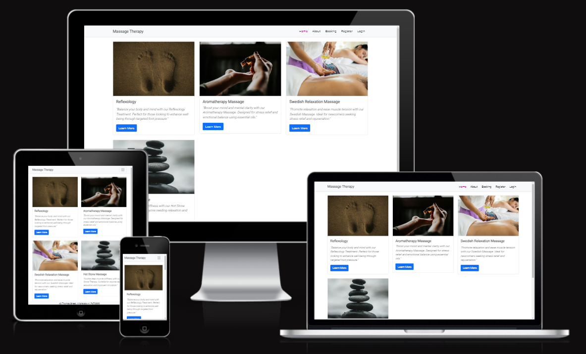
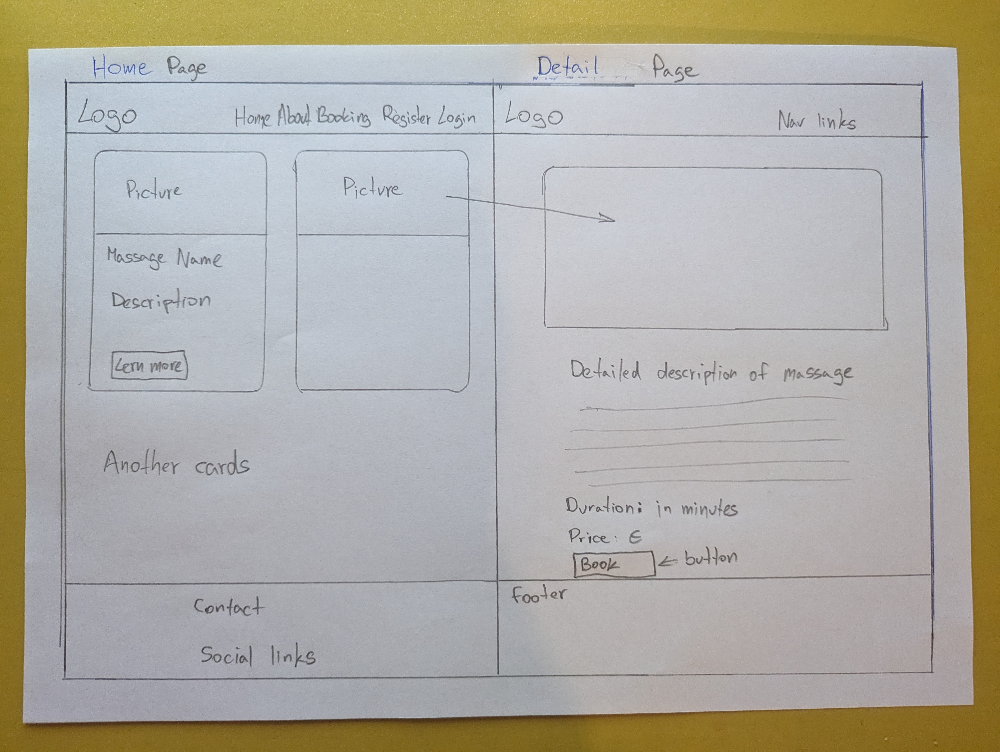
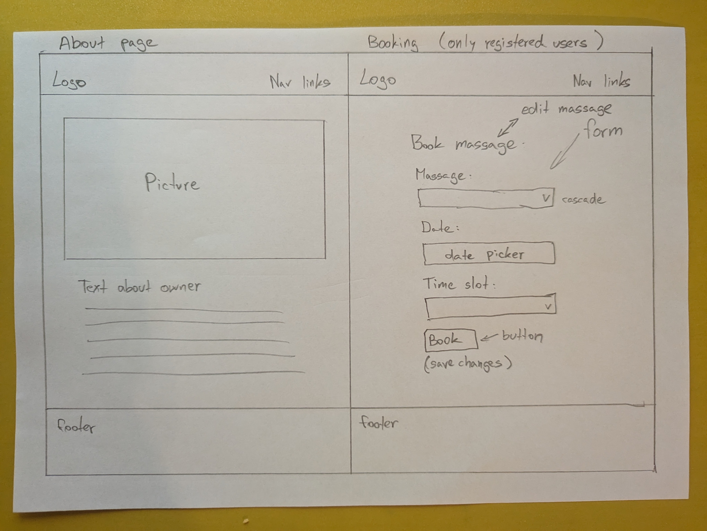
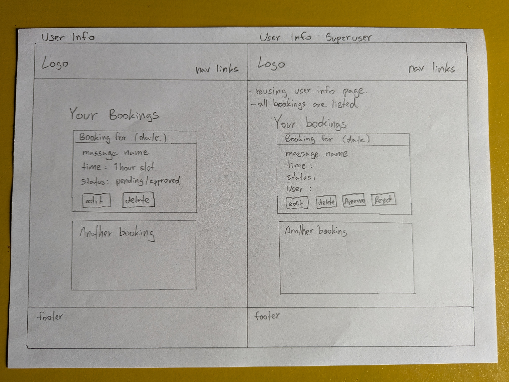
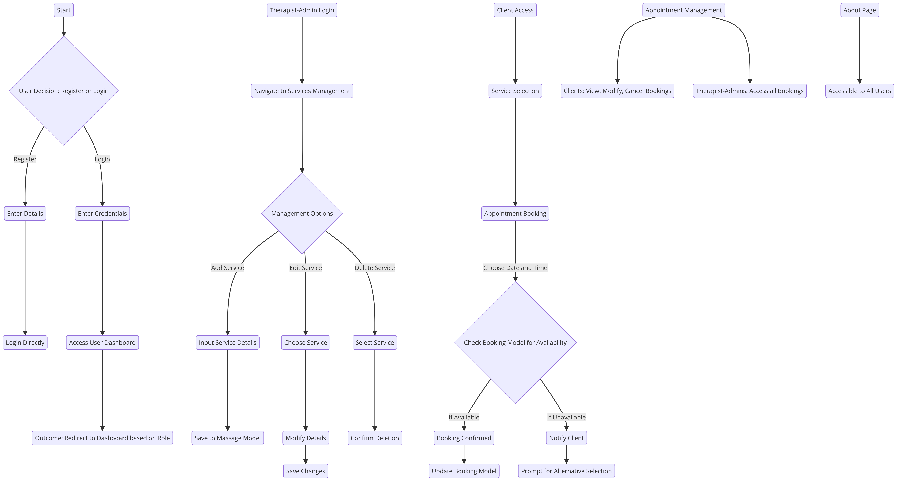
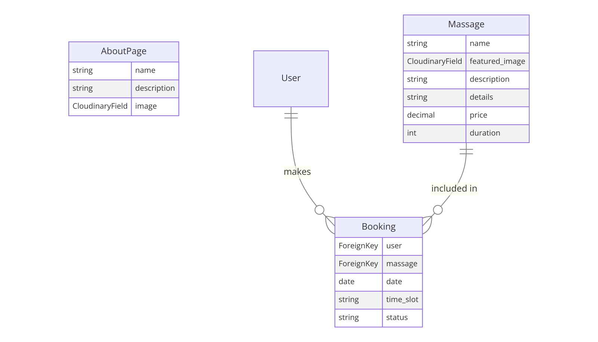

# Massage Therapy Introduction
Welcome to Massage Therapy, my 4th portfolio project. My goal is simple: make massage therapy bookings as easy as a few clicks. Built with Django and  Bootstrap, my site offers a sleek and responsive experience for all users. Whether you're booking your next relaxation session or managing your clients.

[Live Website](https://massage-therapy-fc86f4f7c039.herokuapp.com/)

# **Table Of Contents**
1 [**Planning Phase**](#planning-phase)
  * [**Strategy**](#strategy)
    * [**Service Aims:**](#service-aims)
    * [**Opportunities:**](#opportunities)
  * [**Scope**](#scope)
  * [**Structure**](#structure)
    * [**User Stories:**](#user-stories)
  * [**Skeleton**](#skeleton)
    * [**Wireframes:**](#wireframes)
    * [**User Flow Diagrams:**](#user-flow-diagrams)
    * [**Database Schema**](#database-schema)
  * [**Surface**](#surface)
    * [**Color Scheme:**](#color-scheme)
    * [**Typography**:](#typography)

2 [**Agile Development Process**](#agile-development-process)

3 [**Service Features**](#service-features)
  * [**Booking System**](#booking-system)
    * [**Online Booking:**](#online-booking)
    * [**Appointment Management:**](#appointment-management)

4 [**User Experience (UX)**](#user-experience-ux)

  * [**Design Philosophy**](#design-philosophy)
  * [**Accessibility Features**](#accessibility-features)

5 [**Technologies Used**](#technologies-used)

  * [**Front-End Technologies:**](#front-end-technologies)
  * [**Back-End Technologies:**](#back-end-technologies)

6 [**Testing Phase**](#testing-phase)

  * [**Functional Testing:**](#functional-testing)
  * [**Usability Testing:**](#usability-testing)

7 [**Deployment**](#deployment)
  * [**Deployment Steps:**](#deployment-steps)

8 [**Future Development**](#future-development)

9 [**Credits**](#credits)
  * [**Acknowledgements:**](#acknowledgements)

# Planning Phase

## Strategy
### Service Aims:
- To create a streamlined, user-friendly system for booking and managing massage appointments.

## Opportunities
- Enhance booking experience for clients.
- Efficient scheduling and management for therapists.
- Robust admin features for overall management and insights.

## Scope
### Functional Requirements:
- Dynamic booking system that allows clients to view available services and book appointments based on real-time availability.
### Content Requirements:
- Information about massage services, therapist details, personalized user dashboards.

## Structure
- User-friendly UI with easy navigation for clients, therapists, and admins.

## User Stories:
The goal is to create a user-friendly, secure, and efficient platform that allows for easy management of massage services, bookings, and user accounts.

### Sprint 1: Basic Setup and User Authentication

**Goals**: Establish the foundational framework and secure login functionality. 2 days.

#### User Stories

- **Therapist-Admin**
  - **As a Therapist-Admin, I can securely access the system to manage my business operations, so that the integrity and efficiency of business management are ensured.**
    - **Acceptance Criteria**:
      - Ability to log in and log out of the system.
      - Access to administrative features upon logging in.

#### Client User Stories

- **As a Client, I can register and log in with ease, so that I can efficiently manage my massage bookings.**
  - **Acceptance Criteria**:
    - Ability to register for an account with a username and password.
    - Ability to log in and log out of the web page.

### Sprint 2: Service and Appointment Models

**Goals**: Develop and integrate core functionalities for managing services and appointments. 3 days.

#### Therapist-Admin User Stories

- **As a Therapist-Admin, I can manage massage types, so that I offer various options to my clients.**
  - **Acceptance Criteria**:
    - Ability to add, edit, and delete massage types.
    - Each massage type includes picture, name, duration, price, and description.
    - Changes are immediately visible to clients on the booking platform.

- **As a Therapist-Admin, I can set and update my availability, so that clients only book sessions when I am available.**
  - **Acceptance Criteria**:
    - Availability changes update in real-time on the booking system.
    - The system prevents double-booking of time slots.

#### Client User Stories

- **As a Client, I can browse different types of massages, so that I find the service that suits my needs.**
  - **Acceptance Criteria**:
    - View a list of all available massage types with details.
    - Easy navigation to book selected massage services.

### Sprint 3: Booking Functionality

**Goals**: Implement functionality for clients to schedule appointments based on availability. 4 days.

#### Client User Stories

- **As a Client, I can book appointments based on the therapist's availability, so that I schedule a session conveniently.**
  - **Acceptance Criteria**:
    - Select desired massage type and view available slots.
    - Book an appointment with immediate confirmation.
    - View and manage upcoming appointments.

#### Therapist-Admin User Stories

- **As a Therapist-Admin, I can manage client appointments, so that I keep track of my daily schedule.**
  - **Acceptance Criteria**:
    - View upcoming and past appointments.
    - Reschedule or cancel appointments as needed.
    - Receive notifications after changing appointments.

### Sprint 4: Enhancements and User Interface

**Goals**: Finalize development with a focus on testing, UI/UX improvements, and user-friendly interface enhancements. 4 days.

#### General User Stories

- **As a User (Therapist-Admin, Client), I want a user-friendly and intuitive interface, so that interacting with the system is straightforward and pleasant.**
  - **Acceptance Criteria**:
    - The interface is easy to navigate.
    - Essential functions are accessible within a few clicks.
    - The design is responsive and works on various devices and screen sizes.

#### Therapist-Admin Specific Stories

- **As a Therapist-Admin, I can view and manage client profiles, so that I maintain up-to-date client information.**
  - **Acceptance Criteria**:
    - Access client contact information and booking history.
    - Update client information if needed.
    - Secure handling of client data.

#### Total time planned 13 days.

## Skeleton
### Wireframes
#### Home and Massage detail page.

#### About and Booking page (only for users).

#### User info for user and for superuser.

## User Flow Diagram

## Database Schema

### AboutPage Model

| Field       | Type            | Description                                       |
|-------------|-----------------|---------------------------------------------------|
| name        | CharField       | The name or title of the about page content.      |
| description | TextField       | A detailed description of the massage therapy service. |
| image       | CloudinaryField | An optional image field for storing related imagery. |

### Massage Model

| Field          | Type            | Description                                       |
|----------------|-----------------|---------------------------------------------------|
| name           | CharField       | The name of the massage service.                  |
| featured_image | CloudinaryField | An image representing the massage service, with a default placeholder. |
| description    | TextField       | A brief description of the massage service.       |
| details        | TextField       | Additional details about the massage service.     |
| price          | DecimalField    | The cost of the massage service.                  |
| duration       | IntegerField    | The length of time the massage service takes, in minutes. |

### Booking Model

| Field    | Type         | Description                                                        |
|----------|--------------|--------------------------------------------------------------------|
| user     | ForeignKey   | A link to the Django user model, indicating which user made the booking. |
| massage  | ForeignKey   | A link to the `Massage` model, specifying the type of massage booked. |
| date     | DateField    | The date of the booking.                                           |
| time_slot| CharField    | The time slot of the booking, selected from predefined choices.    |
| status   | CharField    | The status of the booking (e.g., pending, approved, rejected), with default being 'pending'. |

#### Entity Relationship Diagram

### Surface

#### **Color Scheme:**
- **Primary text color**: `#070808` - Used for the main body text, ensuring high contrast and readability.
- **Navigation and card text color**: `#202525` - Provides subtle contrast with lighter backgrounds for elegance and accessibility.
- **Active link color**: `rgb(139, 0, 104)` - A vibrant color highlighting active navigation links, aiding user orientation.
- **Information text on card styling color**: `rgb(22, 13, 13)` - A softer color for differentiating informational text from primary content.

#### **Typography:**
- **Main Fonts Used**: `Roboto`, sans-serif. Roboto is used throughout the site for its modern, readable appearance, applied to body texts, headers, navigation elements, and cards for consistency.
- **Font Weights**:
  - Body text is in standard weight for readability.
  - Headers (`h5`) are bolded with a weight of `900` for emphasis.
  - The `navbar-brand` has a weight of `700` for a balanced, noticeable presence.
- **Fallback Font**: Sans-serif. This generic font family ensures the site remains visually appealing and text is readable where Roboto is not available.

## Agile Development Process

From the start, I embraced an Agile development approach to bring this massage therapy booking platform to life. Agile's iterative nature allowed me to adapt to changes quickly, incorporate feedback efficiently, and ensure that the project continually moved forward in alignment with user needs and project goals.

### Embracing Agile Principles
I committed to the core principles of Agile development, focusing on delivering working software frequently, welcoming changing requirements

### Sprints and Iterations
The project was broken down into several sprints, each with specific goals and deliverables:

- **Sprint 1: Basic Setup and User Authentication** - The foundation was laid, focusing on secure login functionality and basic navigation. 2 days.
- **Sprint 2: Service and Appointment Models** - Core functionalities were developed, including managing services and setting up appointment models. 3 days.
- **Sprint 3: Booking Functionality** - Implemented the crucial booking system, allowing users to schedule appointments based on real-time availability. 4 days.
- **Sprint 4: Enhancements and User Interface** - Finalized the project with a focus on UI/UX improvements, making the interface as user-friendly and responsive as possible. 4 days

- **Overall Reflection on Planned Days**
Throughout the development process, I aimed to adhere closely to the planned durations for each sprint. While I was generally accurate in my estimations, I learned the importance of flexibility and the value of allocating additional time for debugging and enhancing features based on user feedback. This approach not only improved the quality of the platform but also enriched my development skills and project management capabilities.

### Agile Tools and Practices
- **Kanban Board:** Initially overwhelmed by the project's scope, I opted for a written plan, believing it would suffice for managing the development process. However, upon completing the project, I recognized the value of visual organization and transferred all user stories to a digital Kanban board. This shift not only helped me reflect on the project's workflow and scope but also became a pivotal tool for planning future enhancements, providing me with a clear, visual overview of the project's achievements.
- **Daily Standups:** Although working independently, I maintained the discipline of daily standups (with myself), reviewing what was accomplished the previous day and setting goals for the current day.
- **User Stories:** These were crucial in guiding the development process, ensuring that every feature developed served a direct user need or improved the user experience in a meaningful way.
- **Retrospectives:** At the end of each sprint, I took time to reflect on what went well, what could be improved, and how to make the next sprint even more productive.

### Continuous Feedback and Adaptation
Feedback loops were integrated throughout the development process. By presenting working versions of the software to my mentor and friends, I gathered invaluable insights that informed future development decisions and feature improvements.

### Looking Forward
Using the Agile method in this project taught me a lot about flexibility and quick adaptation. The Agile approach's benefits are clear and will definitely guide how I work on future projects.

