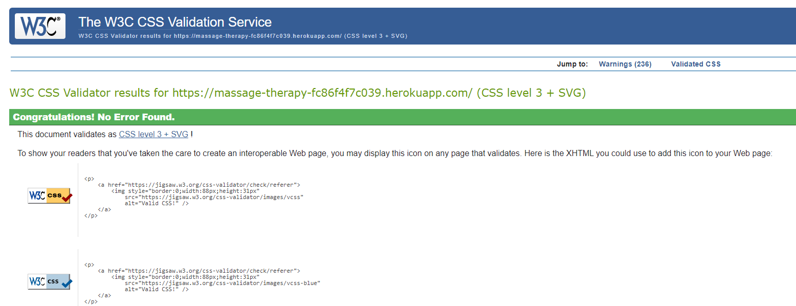
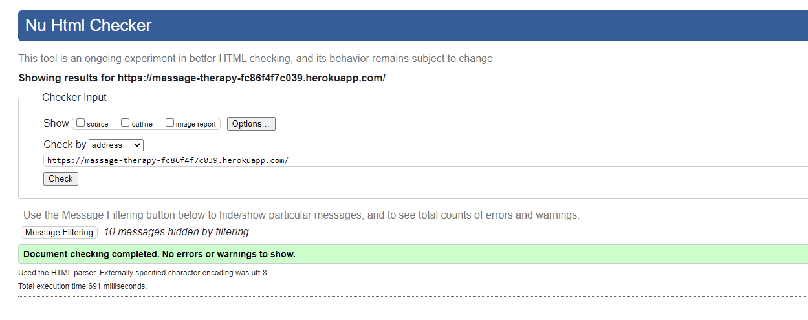
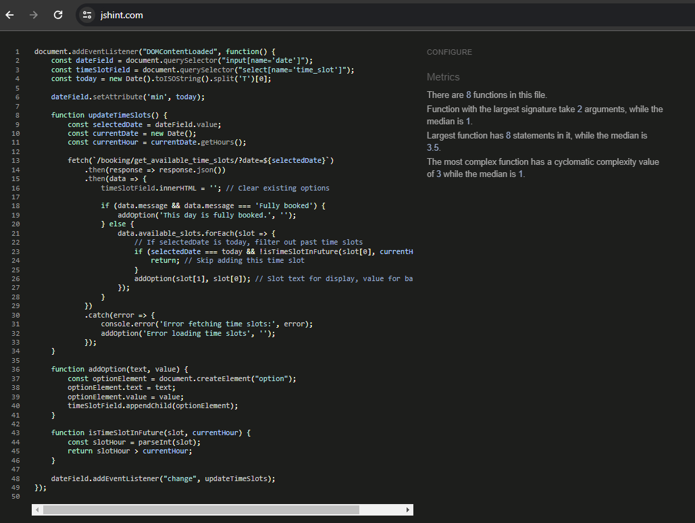

## Testing Phase

### Functional Testing

#### User Authentication
- **Test Case 1**: Register a new user with valid details.
  - **Expected Outcome**: User is registered and receives a confirmation message.
  - **Actual Outcome**: User is registered successfully but does not receive an email confirmation due to disabled settings. ✅
- **Test Case 2**: Attempt login with correct user credentials.
  - **Expected Outcome**: User successfully logs in and is redirected to the homepage.
  - **Actual Outcome**: User successfully logs in and is redirected to the homepage. ✅

#### Viewing Massage Services
- **Test Case 4**: View list of available massage services.
  - **Expected Outcome**: All available services are displayed with details.
  - **Actual Outcome**: All services are correctly displayed with detailed information. ✅
- **Test Case 5**: View details of a specific massage service.
  - **Expected Outcome**: Detailed service page loads with accurate information.
  - **Actual Outcome**: Service details are accurately displayed, including description, price, and duration. ✅

#### Booking Appointments
- **Test Case 6**: Book an appointment with a selected massage service.
  - **Expected Outcome**: Booking is successful, and user receives a confirmation.
  - **Actual Outcome**: Booking is successful. User is redirected to a confirmation page but does not receive an email confirmation. ✅
- **Test Case 7**: Attempt to book an appointment for a fully booked slot.
  - **Expected Outcome**: System prevents booking and notifies user of unavailability.
  - **Actual Outcome**: User is informed that the slot is fully booked and is prompted to select another time. ✅

#### Admin Functions
- **Test Case 8**: Admin adds a new massage service.
  - **Expected Outcome**: Service is added and visible to users.
  - **Actual Outcome**: New service added successfully and appears in the list of available services. ✅
- **Test Case 9**: Admin edits details of an existing service.
  - **Expected Outcome**: Changes are saved and reflected immediately.
  - **Actual Outcome**: Edited details are correctly updated and immediately visible on the service page. ✅
- **Test Case 10**: Admin deletes a massage service.
  - **Expected Outcome**: Service is removed and no longer visible to users.
  - **Actual Outcome**: Service successfully deleted and no longer listed or accessible to users. ✅

### Usability Testing

#### Navigation and Layout
- **Test Case 11**: First-time user attempts to navigate through the website.
  - **Expected Outcome**: User finds it easy to navigate and locate booking, services, and login pages.
  - **Actual Outcome**: Users reported easy navigation. ✅

#### Content Clarity
- **Test Case 12**: User reads descriptions of massage services.
  - **Expected Outcome**: Descriptions are clear and provide sufficient detail to make a booking decision.
  - **Actual Outcome**: Most users found the descriptions helpful. ✅

#### Visual Design and Aesthetics
- **Test Case 13**: Collect user feedback on the website's visual design.
  - **Expected Outcome**: The design is found to be appealing and enhances the browsing experience.
  - **Actual Outcome**: Feedback was overwhelmingly positive on the design, with users appreciating the clean, modern look. ✅

#### Error Messages and Feedback
- **Test Case 14**: User enters invalid data in a booking form.
  - **Expected Outcome**: User receives a clear and helpful error message.
  - **Actual Outcome**: Error messages were clear. ✅
- **Test Case 15**: User successfully books an appointment.
  - **Expected Outcome**: User receives positive feedback confirming the booking.
  - **Actual Outcome**: Users appreciated the on-screen confirmation, though some missed not having an email confirmation due to disabled settings. ✅

### Manual testing

| Feature                           | User Story                                                                                   | Test Case Description                                        | Expected Outcome                                                        | Actual Outcome                   |
|-----------------------------------|----------------------------------------------------------------------------------------------|-------------------------------------------------------------|------------------------------------------------------------------------|----------------------------------|
| **Secure Login**                  | As a Therapist-Admin, I can securely access the system to manage my business operations.     | Attempt to log in with valid admin credentials.             | Successful login and redirection to the admin dashboard.               | Worked as expected.              |
|                                   |                                                                                              | Attempt to log in with invalid admin credentials.           | Display of an error message and stay on the login page.                | Error displayed as expected.     |
| **User Registration & Login**     | As a Client, I can register and log in with ease.                                            | Register a new user account with valid details.             | Account creation success message and redirection to login page.        | Registration successful.         |
|                                   |                                                                                              | Log in with newly created user account.                     | Successful login and redirection to the home page.                     | Login and redirection successful.|
| **View and Book Massages**        | As a Client, I can browse different types of massages and book appointments.                  | Browse available massage types and book an appointment.     | List of services displayed with booking confirmation for selected type.| Booking process smooth and intuitive.|
|                                   |                                                                                              | Attempt to book an appointment without logging in.          | Redirection to login page with prompt to log in or register.           | Redirected to login as expected. |
| **Manage Massage Services**       | As a Therapist-Admin, I can manage massage types and details.                                 | Add, edit, and delete a massage service.                    | Successful addition, update, and deletion of massage services.         | Services managed without issues. |
| **Client Booking Management**     | As a Client, I can manage my bookings.                                                        | View, reschedule, and cancel bookings.                      | Successful display, rescheduling, and cancellation of bookings.        | All booking actions functioned as intended.|
| **Appointment Scheduling**        | As a Client, I want to schedule appointments based on therapist availability.                 | Schedule an appointment using the booking system.           | Appointment is booked successfully, considering therapist availability.| Appointment scheduled successfully.|
| **Admin Appointment Management**  | As a Therapist-Admin, I can view and manage all appointments.                                 | View all client appointments and update their status.       | Successful overview and status update of appointments.                 | Admin controls worked flawlessly.|
| **Feedback and Notifications**    | As a User, I want to receive immediate feedback or notifications related to my actions.       | Perform actions like booking, cancelling, and logging in.  | Immediate and appropriate feedback or notifications for actions taken. | Feedback and notifications received as expected.|
| **User Experience (UX) and Design**| As a User, I expect a user-friendly interface that simplifies navigation and booking.        | Navigate through the site to find information and book services. | Intuitive navigation with easy access to booking and service information.| Site navigation met user expectations.|
| **Responsive Design**             | As a User, I want to access the site from any device with optimal viewing experience.         | Access the site from various devices (desktop, tablet, mobile).| The site is responsive and provides a seamless experience on all devices.| Responsive design confirmed across devices.|
| **Security and Data Privacy**     | As a User, I expect my data to be handled securely and privacy to be maintained.              | Register, login, and perform transactions on the site.      | User data is handled securely with privacy considerations in place.     | No user data collected|

### Browser Compatibility:
- I tested the website on Chrome, Mozzila and Edge. No issues found.

### Validators

#### Lighthouse performance test
- [Desktop](./documentation/images/testing/lighthouse_desktop.png)
- [Mobile](./documentation/images/testing/lighthouse_mobile.png)

#### Python testing
- Python validation using [CI Python Linter](https://pep8ci.herokuapp.com/). No errors found.
##### Treatments app:
- [Admin.py](./documentation/images/testing/admin1.png)
- [Models.py](./documentation/images/testing/models1.png)
- [Urls.py](./documentation/images/testing/urls1.png)
- [views.py](./documentation/images/testing/views1.png)

##### About app: 
- [Admin.py](./documentation/images/testing/admin2.png)
- [Models.py](./documentation/images/testing/models2.png)
- [Urls.py](./documentation/images/testing/urls2.png)
- [views.py](./documentation/images/testing/views2.png)

##### Booking app:
- [Admin.py](./documentation/images/testing/admin3.png)
- [Models.py](./documentation/images/testing/models3.png)
- [Forms.py](./documentation/images/testing/forms3.png)
- [Urls.py](./documentation/images/testing/urls3.png)
- [views.py](./documentation/images/testing/views3.png)

##### Main project urls:
- [Urls.py](./documentation/images/testing/urls4.png)

#### W£C CSS Validation service:

#### html checker:

#### Jshint validator:

### BUGS resolved

Throughout the development of the Massage Therapy project, several bugs were encountered and subsequently resolved. Here's a summary:

1. **Issue with Static Files Not Loading**: Initially, static files such as CSS and JavaScript were not loading correctly.
   - **Resolution**: This was fixed by correctly setting up `STATIC_URL` and `STATIC_ROOT` in the `settings.py` file and using `collectstatic` command to gather static files in the deployment environment.

2. **Template Does Not Update with New Data**: Changes in the database were not reflecting immediately on the templates.
   - **Resolution**: The issue was resolved by ensuring querysets in views were correctly set to fetch the latest data and by enabling proper template rendering.

3. **Database Migration Errors**: Encountered issues when trying to migrate changes to the database models.
   - **Resolution**: Solved by reviewing the error logs to identify the faulty migration file, then rolling back to a previous migration state and reapplying the migrations.

4. **Responsive Design Inconsistencies**: The site was not displaying correctly on various devices.
   - **Resolution**: Utilized Bootstrap's grid system more effectively.

5. **Form Validation Errors Not Displaying**: Users were not being alerted to form input errors.
   - **Resolution**: Implemented custom error handling in the forms to display validation errors next to the relevant fields.

6. **Incorrect URL Configuration**: Had issues with URL patterns that caused navigation errors.
   - **Resolution**: Reviewed and corrected `urlpatterns` in the `urls.py` files of both project and app levels to ensure correct path and namespace usage.

7. **Booking Overlap**: The system allowed for double booking of the same time slot.
   - **Resolution**: Introduced a validation check in the booking form's `clean` method to ensure no overlapping bookings could be made.

8. **Static Files Handling in Deployment**: Static files were not served correctly in the Heroku deployment.
    - **Resolution**: Configured `whitenoise` middleware correctly in `settings.py` to manage static files efficiently in the production environment.

9. **Cloudinary Image Upload Issues**: Encountered problems uploading images to Cloudinary.
    - **Resolution**: Ensured the `CLOUDINARY_STORAGE` settings were correctly configured and updated Cloudinary's API keys in the environment variables.

10. **Integration of Rich Text Editor**: Summernote widget was not displaying in the admin for text fields.
    - **Resolution**: Added `django-summernote` to `INSTALLED_APPS` and configured its settings in `settings.py`, ensuring the rich text editor was available for applicable fields in the admin.

### BUGS unresolved:
- Iam not aware of any remaining bugs.

### Resubmission 

 - Added login_required Decorator: The edit_booking view now requires users to be logged in to access it.
 - Ownership Check: Implemented a check to ensure that a registered user cannot edit bookings that belong to other users by entering the URL.
 - Deleted Closing p Tag: Removed an extra closing 
 tag in the about.html page.
 - Replaced 
 with 
 for Summernote Text: Updated the HTML to use 
 tags instead of 
 tags for content generated by Summernote.

